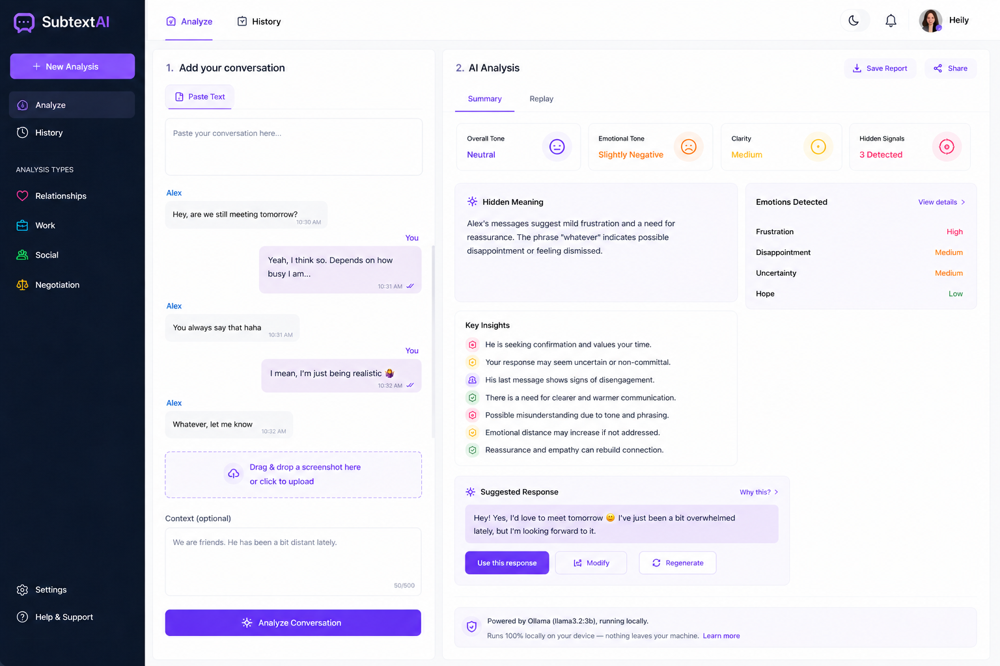
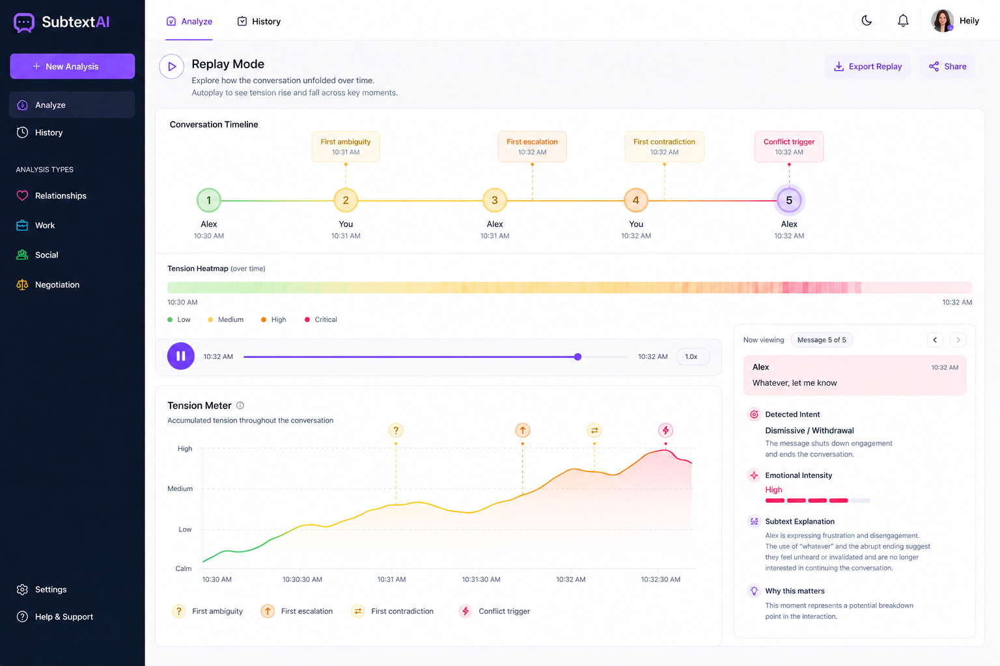
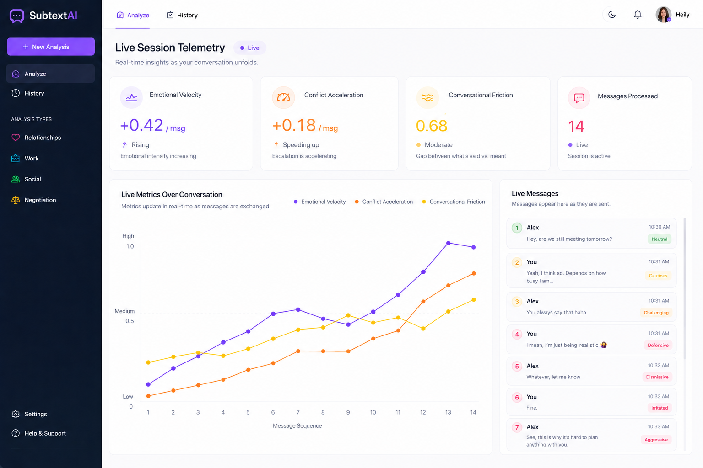
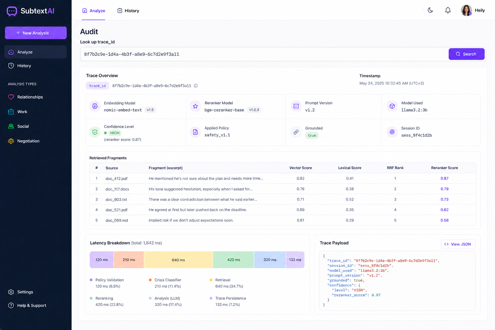
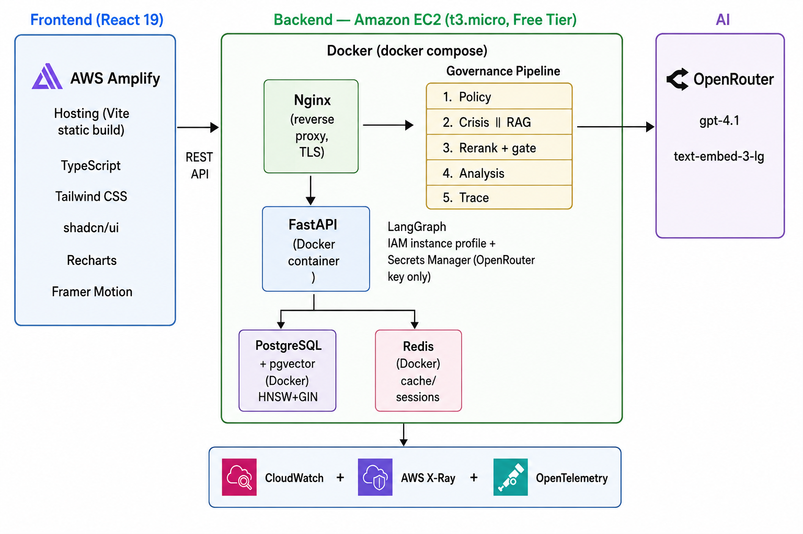

# SubtextAI

> Understand what people really mean.

AI-powered communication intelligence platform that helps people understand intent, emotions, and hidden meaning behind ambiguous conversations.

`Python` · `FastAPI` · `React 19` · `AWS` · `OpenRouter` · `PostgreSQL + pgvector` · `Docker`

## Screenshots

| Analysis | Replay Mode | Live Telemetry | Audit |
|-|-|-|-|
|  |  |  |  |

---

## Overview

SubtextAI is a communication intelligence engine that analyzes ambiguous conversations across real-world contexts — **relationships, work, social settings, and negotiation** — and turns them into structured insights about what was said, what may have been intended, and what evidence supports that interpretation.

It detects intent shifts and emotional intensity, retrieves the documentary evidence behind each interpretation, scores it with a confidence level, and keeps it fully auditable by `trace_id`.

---

## The Problem

Most misunderstandings aren't about what's said — they're about what's meant.

Tone, intent, and emotional subtext get lost in text-based communication, and by the time a conflict escalates, it's hard to pinpoint where the interpretation diverged from the intention. Generic AI assistants don't help here: they generate plausible-sounding answers without explaining why, and without any way to verify the reasoning behind them.

For high-stakes or emotionally sensitive conversations, plausibility is not enough — users need context, evidence, uncertainty, and a way to reconstruct how an interpretation was produced.

---

## Why SubtextAI?

Unlike a general-purpose assistant, SubtextAI is not a black box. It doesn't just generate an answer it explains why a message may be interpreted a certain way, points to the evidence behind that interpretation, and helps the user decide how to respond.

## Philosophy

AI should improve human communication, not replace it.

Every insight should be explainable.

Every response should be grounded.

Every decision should be auditable.

No interpretation should be presented as absolute truth.

This system does not replace professional advice, therapy, or legal counsel.

---

## Key Features

**Conversation Analysis** — Paste any ambiguous message with its context and get a complete pragmatic analysis: what was said vs. what was meant.

**Intent Detection** — Identifies intent transitions throughout the conversation (e.g., `neutral → defensive → aggressive`).

**Emotion Detection** — Tracks emotional intensity per message (low / medium / high) and detects escalation patterns.

**Hidden Meaning** — Surfaces the gap between explicit and implicit meaning — the subtext that drives miscommunication.

**Response Evaluation** — Scores a response the user already wrote: success probability, strengths, areas for improvement, and an evidence-based alternative.

**Reply Drafting** — When the user doesn't know what to say, the system writes the reply itself — grounded in the same sources as the original analysis, with a chosen tone and goal.

**Replay Mode** — Transforms any analyzed conversation into an interactive timeline of emotion, intent, and tension — like a replay of human decisions. Includes autoplay demo with pre-recorded conversations.

**Live Session Telemetry** — Real-time panel tracking emotional velocity, conflict acceleration, and accumulated tension as the conversation unfolds, message by message.

**Evidence & Confidence Gate** — Every interpretation is evaluated against retrieved evidence and a confidence threshold; when the evidence is insufficient, generation is blocked rather than producing an unsupported interpretation.

---

## How It Works

```
Conversation Input
        ↓
Context & Safety Analysis
        ↓
Parallel Retrieval + Policy Checks
        ↓
Hybrid Search + Reranking
        ↓
Confidence Gate
        ↓
Structured Analysis
        ↓
Response Generation
        ↓
Trace & Audit
```

> Full technical pipeline in [docs/ai-pipeline.md](docs/ai-pipeline.md)

---

## Why SubtextAI is Different

| Principle | What it means |
|-|-|
| **Explainable AI** | Every interpretation is grounded in documentary sources — the confidence gate is designed to block generation when no solid evidence is found. |
| **Policy-Governed AI** | Security and safety policies are enforced in the execution pipeline rather than delegated to the model prompt. |
| **Full Traceability** | Every response is reconstructible via `trace_id`: documents, scores, prompt version, model, and policies evaluated. |
| **Privacy by Design** | Raw text and audit annotations are stored separately, so erasure requests and retention limits never break the audit trail. |

> Learn more in [docs/design-principles.md](docs/design-principles.md)

---

## Architecture

<p align="center">
  
</p>

A request enters through the API and is checked for crisis signals while relevant evidence is retrieved from the document corpus in parallel. The retrieved evidence is scored and evaluated against a confidence gate — if it doesn't clear the threshold, no response is generated. Applicable policies are checked alongside retrieval, and once a response is accepted for generation, it's produced and logged with full trace metadata (documents used, scores, prompt version, model, policies evaluated) for later audit.

The current deployment is intentionally lightweight: a single EC2 instance runs the backend stack in Docker (FastAPI, PostgreSQL + pgvector, Redis, Nginx), with the frontend, auth, storage, secrets, and observability handled by separate managed services.

> Full architecture documentation in [docs/architecture.md](docs/architecture.md)

---

## Tech Stack

| Layer | Technology |
|-|-|
| **Frontend** | React 19, TypeScript, Vite, Tailwind CSS, shadcn/ui, Recharts, Framer Motion |
| **Backend** | Python 3.13, FastAPI, Pydantic v2, SQLAlchemy 2.0, Alembic |
| **AI** | OpenRouter (`gpt-4.1`, `text-embedding-3-large`), LangGraph, Structured Outputs |
| **RAG** | PostgreSQL + pgvector (HNSW), lexical search, RRF fusion, cross-encoder reranking |
| **Data** | PostgreSQL + pgvector and Redis, both in Docker containers on the same Amazon EC2 instance |
| **Security** | Amazon Cognito (OAuth2 + IAM), rate limiting, prompt injection detection |
| **Observability** | Amazon CloudWatch, AWS X-Ray, OpenTelemetry |
| **DevOps** | Docker, Amazon EC2 (Free Tier `t3.micro`), Nginx, Amazon ECR, AWS Amplify Hosting, GitHub Actions (OIDC to AWS), Ruff, Pytest |

> Detail and rationale in [docs/tech-stack.md](docs/tech-stack.md)

---

## Deployment

SubtextAI deploys to AWS, sized to run within the **Free Tier**: a single **Amazon EC2** `t3.micro` instance runs the whole backend stack in Docker — **FastAPI**, **PostgreSQL + pgvector**, **Redis**, and **Nginx** as the reverse proxy — fronted by **Amplify Hosting** (frontend), **S3** for the document corpus, and **OpenRouter** for generation (`gpt-4.1`) and embeddings (`text-embedding-3-large`).

### Quick Start

1. Build the backend image and push it to Amazon ECR.
2. Store the OpenRouter API key in AWS Secrets Manager.
3. Launch the EC2 instance and run `docker compose up -d` to start API + PostgreSQL + Redis + Nginx together.
4. Run `alembic upgrade head` against the Postgres container to apply migrations.
5. Build the frontend and deploy it to Amplify Hosting.

### Prerequisites

* Python 3.13+
* Node.js 18+ and npm
* Docker (for building the backend image)
* An AWS account with the AWS CLI configured, and an EC2 key pair
* An [OpenRouter](https://openrouter.ai) API key

> Full step-by-step guide — IAM instance profile, Nginx config, backup strategy, and environment variables — in [docs/cloud-deployment-aws.md](docs/cloud-deployment-aws.md) and [docs/deployment.md](docs/deployment.md)

---

## Documentation

- [Architecture](docs/architecture.md)
- [AI Pipeline](docs/ai-pipeline.md)
- [Design Principles](docs/design-principles.md)
- [Technology Stack](docs/tech-stack.md)
- [Testing Strategy](docs/testing-strategy.md)
- [Deployment Guide](docs/deployment.md)
- [API Reference](docs/api-reference.md)
- [Screenshots](docs/screenshots.md)
- [Roadmap](docs/roadmap.md)
- [Cloud Deployment (AWS)](docs/cloud-deployment-aws.md)

---

## Roadmap

### Vision

Become the communication intelligence platform for personal and enterprise conversations.

| Phase | Description |
|-|-|
| **Current** | Core analysis pipeline, retrieval, reranking, policy enforcement, and traceability. |
| **Next** | Specialized crisis classifier, multilingual support, semantic caching, and expanded audit tooling. |
| **Future** | Real-time streaming analysis, predictive trajectory engine |

> Detail in [docs/roadmap.md](docs/roadmap.md)

---

## Author

**Heily Madelay Tandazo**

## License

Distributed under the MIT License — see [LICENSE](LICENSE) for details.
